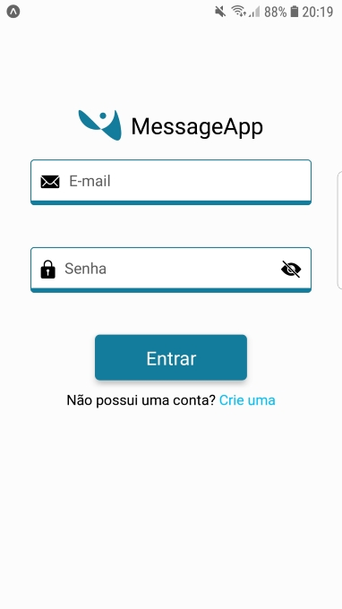
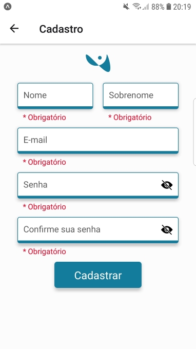
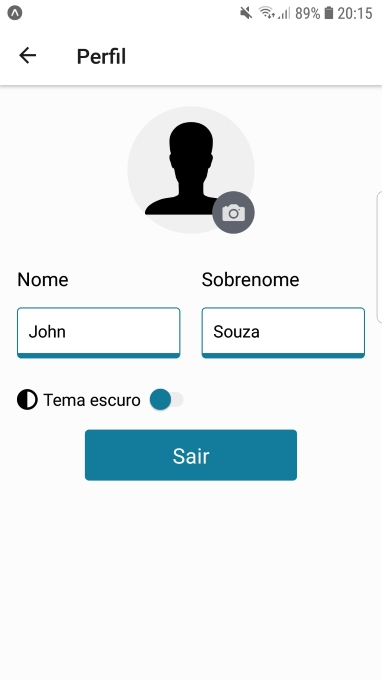
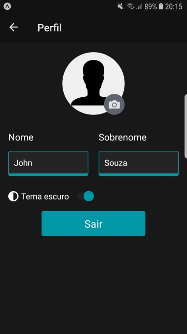
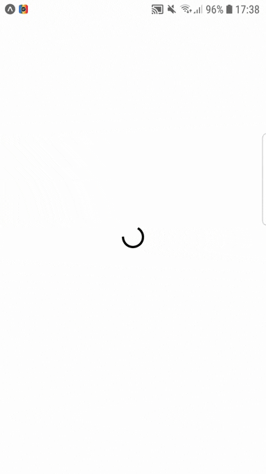

#  MessageApp
Um aplicativo de mensagem simples utilizando Expo + Firebase


Login                      |  Signup
:-------------------------:|:-------------------------:
  |  

Light Theme Profile        |  Dark Theme Profile
:-------------------------:|:-------------------------:
 |  

Light Theme Demo           |  Dark Theme Demo
:-------------------------:|:-------------------------:
 |  

## 🛠 Pré-requisitos

Antes de começar, você vai precisar ter instalado em sua máquina as seguintes ferramentas:
[Node.js](https://nodejs.org/en/), [Yarn](https://yarnpkg.com/), [Expo-CLI](https://docs.expo.io/) . 
E ter um editor para trabalhar com o código como [VSCode](https://code.visualstudio.com/)

### 🚀 Instalação

```bash
# Clone este repositório
$ git clone <https://github.com/JohnKGS/expo-message-app>

# Acesse a pasta do projeto
$ cd expo-message-app

# Instale as dependências
$ yarn install ou npm install

# Vá para a pasta src/firebaseConfig e adicione sua configuração do firebase

# Execute a aplicação
$ expo start
```
### 💻 Tecnologias

As seguintes ferramentas foram usadas na construção do projeto:

- [Expo](https://expo.io/)
- [Node.js](https://nodejs.org/en/)
- [React](https://reactjs.org/)
- [React Native](https://reactnative.dev/)
- [Firebase](https://firebase.google.com/)
- [Formik + Yup](https://formik.org/)
- [Styled Components](https://styled-components.com/)

Desenvolvido por John Kelvin Gonçalves de Souza
